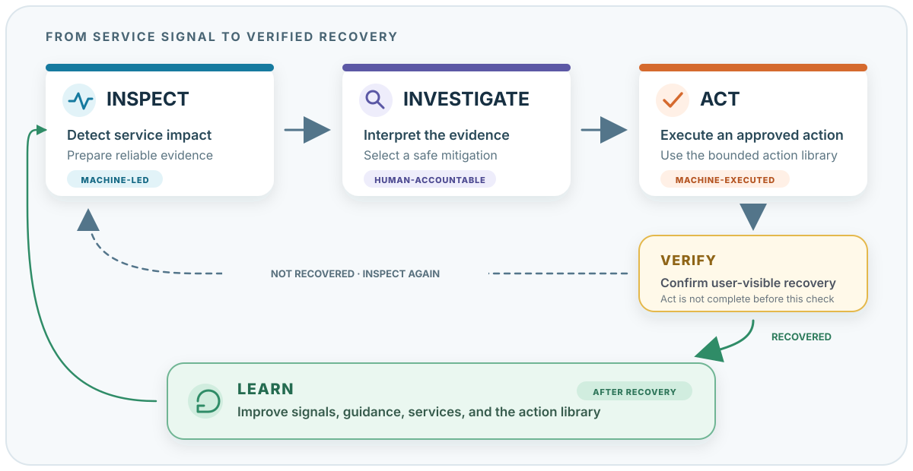

# Operations Building Block

The EOEPCA Operations Building Block helps an operator turn evidence of a
service problem into a safe, verified response. It connects monitoring,
investigation, action, and learning. It does not replace operator judgement or
service-specific knowledge.

{ .operations-model }

If you are new to the platform, read the pages in this order:

1. Read the [Operating Model](operating-model.md) to understand **Inspect**,
   **Investigate**, **Act**, **Verify**, and **Learn**.
2. Use [Observability Basics](basic-concepts.md) to learn what metrics, logs,
   alerts, and SLOs can tell you.
3. Open the [Monitoring Stack](monitoring-stack.md) to see which deployed tool
   provides each type of evidence.
4. Follow [Dashboards and Usage](dashboards-and-usage.md) and
   [Alerting and SLOs](alerting-and-slos.md) when you respond to a service
   symptom.
5. Use [Security Operations](security-operations.md) when you inspect policy,
   access, vulnerability, secret, certificate, or audit controls.
6. Work through the [STAC Service Path](stac-scenario.md) to see the complete
   workflow for one user-facing service.

## Know What Is Available

The pages distinguish deployed capability from work that is still being
established. This distinction prevents an operator from depending on a
capability that does not yet exist.

| Capability | Demo status | What it gives an operator |
| --- | --- | --- |
| Platform metrics and logs | Deployed | Prometheus metrics and Loki logs for platform and selected application components. |
| Dashboards, alert evaluation, and alert routing | Deployed | Grafana views, Prometheus rules, Alertmanager routing, and Keep triage. |
| STAC service-path evidence | Partially established | Gateway, proxy, workload, database, log, synthetic, and SLO signals. Native metrics inside `eoapi-stac` are still limited. |
| Security controls and evidence | Declared in the demo deployment | Policy, scan, identity, network, secret, certificate, audit, and alert controls. Confirm that each control produces current evidence before relying on it. |
| Remediation-action library | Being established | A future set of named, bounded actions with approval and service-level verification. |

## How the Pieces Fit Together

Prometheus and synthetic checks detect a symptom. Alertmanager routes the
alert, and Keep gives the operator a place to triage it. Grafana combines
Prometheus metrics with Loki logs so that the operator can narrow the failure
domain. Kubernetes shows workload health. Security reports add policy and
vulnerability evidence.

These tools support decisions. They do not prove a root cause or make a change
safe by themselves. The operator must select an action, confirm its target and
preconditions, and verify the user-facing result.

## Apply the Guidance Safely

- Start with the affected user outcome, not with a favourite tool.
- Check the monitoring path itself when evidence is missing or inconsistent.
- Treat recent changes, logs, and scan findings as evidence. Do not treat them
  as proof without corroboration.
- Verify the external service result after a change. A successful command or a
  healthy Pod is not sufficient.

## Deployment Sources

The demo deployment sources are in
[`eoepca-plus/argocd/eoepca/operations`](https://github.com/EOEPCA/eoepca-plus/tree/deploy-develop/argocd/eoepca/operations).
The deployable parts are under `parts/`. This repository contains the
documentation.

## Why This Matters

EO platforms contain services, gateways, databases, and background
components. Operators lose time when these parts expose different or unclear
signals. A shared operating model helps teams detect service degradation,
prepare evidence, choose a safe response, verify recovery, and improve the next
incident response.
