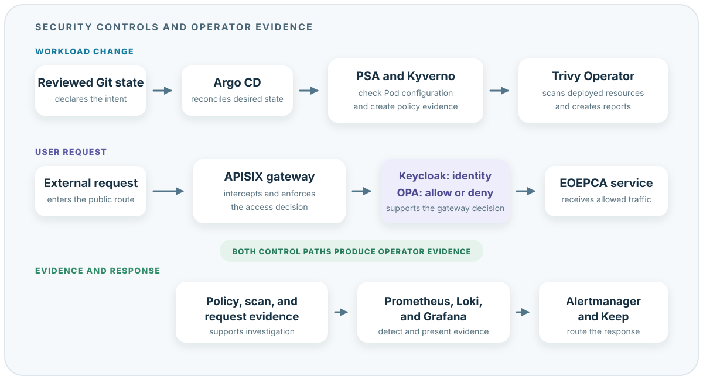

# Security Operations

Security in EOEPCA uses a chain of controls. No single tool provides complete
protection. Some controls prevent or limit an action. Other controls find risk,
record evidence, or notify an operator.

This page explains why each control exists, what an operator can do with it,
and how to apply it safely. It describes the controls in the `deploy-develop`
deployment.

## Start With the Security Question

Do not start by choosing a product. First identify the boundary or evidence
that you need.

| Security question | Use these controls | Why they exist | Best first use |
| --- | --- | --- | --- |
| Can this workload use an acceptable Pod configuration? | Pod Security Admission (PSA) and Kyverno | They compare Pod specifications with a defined security standard. | Check namespace labels, admission warnings, and current policy reports. |
| What known risk exists in a deployed workload? | Trivy Operator | It finds vulnerable packages, exposed secret patterns, unsafe configuration, broad RBAC, and compliance gaps. | Confirm report coverage and age before you assess individual findings. |
| Who can call an EOEPCA service, and what can they do? | Keycloak, Open Policy Agent (OPA), and Apache APISIX | They separate identity, authorization decisions, and request enforcement. | Test one allowed request and one denied request through the public route. |
| What can a workload access inside the cluster? | Kubernetes RBAC and NetworkPolicy | They limit Kubernetes API permissions and network paths. | Inspect effective permissions, then test one allowed flow and one denied flow. |
| How should a secret or certificate reach a workload? | Sealed Secrets, External Secrets Operator (ESO), and cert-manager | They protect Git-stored values, synchronize externally stored values, and manage TLS certificates. | Choose one source-of-truth model, limit access, and monitor synchronization or renewal. |
| What happened, and does someone need to respond? | Grafana Alloy, Loki, Prometheus, Grafana, Alertmanager, and Keep | They collect evidence, detect conditions, present context, and route the response. | Trace a safe test event from its source to the operator notification. |

## Understand What Each Part Does

- **PSA** is a built-in Kubernetes admission check. Use it for a clear namespace
  security boundary. It does not scan images or authorize application users.
- **Kyverno** adds policy reports, background checks, and narrow, reviewed
  exceptions. Use it to inspect existing resources and policy results. In the
  current audit phase, it does not reject a violating workload.
- **Trivy Operator** scans the live Kubernetes estate and writes report
  resources. Use reports as investigation input. A finding does not prove that
  a vulnerability is exploitable, and a clean report count does not prove full
  coverage.
- **Keycloak** authenticates the caller and issues identity claims. **OPA**
  decides whether the request is allowed. **APISIX** enforces that decision on
  the gateway route. A successful login tests only the first part of this path.
- **RBAC** controls Kubernetes API actions. **NetworkPolicy** controls selected
  Pod network paths. One cannot replace the other.
- **Sealed Secrets** protects encrypted values stored in Git. **ESO** copies
  values from an external store. **cert-manager** obtains and renews TLS
  certificates. All three finally depend on correct Kubernetes access control.
- **Alloy and Loki** collect and store logs. **Prometheus and Grafana** provide
  metrics, rules, and dashboards. **Alertmanager and Keep** route and coordinate
  a response. These tools report state; they do not enforce a policy.

## How the Pieces Work Together

There are two main control paths. A workload change goes through Kubernetes
policy controls. A user request goes through the identity and authorization
controls. Both paths produce evidence for the monitoring and response tools.

{ .operations-diagram }

## Apply the Operating Model

| Stage | Security operator activity |
| --- | --- |
| **Inspect** | Check dashboard state, alert state, report freshness, scan coverage, and audit-source health. |
| **Investigate** | Confirm the affected resource, image digest, identity, route, policy, time, and evidence source. Distinguish a finding from its actual exposure and impact. |
| **Act** | Make the smallest reviewed change. Keep exceptions narrow, approvals explicit, and targets unambiguous. |
| **Verify** | Repeat an expected pass and failure. Confirm that the control produces the expected result and that evidence reaches the operator. |
| **Learn** | Improve policy, coverage, alerts, investigation guidance, exceptions, or control design after the immediate risk is contained. |

## Understand the Policy Boundaries

EOEPCA uses policy at different boundaries. Operators must select the correct
evidence for the question that they investigate.

### Kubernetes workload policy

PSA and Kyverno inspect Kubernetes resources. In this deployment, namespaces
opt in to Restricted checks with the `pod-security.kubernetes.io/audit` label.
Native PSA checks the Kubernetes `v1.35` Restricted rules and creates admission
warnings. Kyverno performs a complementary `v1.32` Restricted background audit
and writes `PolicyReport` resources.

The two versions are intentional. Native PSA covers the policy version of the
cluster. The installed Kyverno version supports a lower version for its
version-pinned Pod Security rule. During an upgrade, operators must review both
results. A pass at `v1.32` does not guarantee a pass at `v1.35`.

The current Kyverno policy uses `Audit` and `failurePolicy: Ignore`. It collects
evidence without rejecting workloads. This is safe for a first rollout, but it
means that a violation can continue to run. Enforcement is a separate,
reviewed change after the audit findings are resolved.

### EOEPCA request policy

Keycloak, OPA, and APISIX control access to EOEPCA services:

1. APISIX receives an external request.
2. Its OpenID Connect plugin validates the user session or token against
   Keycloak.
3. Keycloak supplies identity, client, group, and role claims.
4. The APISIX OPA plugin sends the relevant request context to OPA.
5. OPA evaluates the EOEPCA policy and returns an allow or deny decision.
6. APISIX forwards only an allowed request to the service.

This path is different from Kyverno. Kyverno decides whether a Kubernetes
resource conforms to cluster policy. OPA decides whether an authenticated user
can perform an EOEPCA operation. Tests must cover both policy planes.

## Roll Out Pod Security

### What to change

Enable Restricted Pod Security in stages for each application namespace:

1. Inventory the active Pods and their owning `Deployment`, `StatefulSet`,
   `DaemonSet`, `Job`, or `CronJob`.
2. Add version-pinned `audit` and `warn` labels to one namespace.
3. Restart or update a representative workload so admission checks its Pod
   template.
4. Review native warnings and Kyverno policy reports.
5. Correct the owning controller template. Do not patch only the current Pod.
6. Test install, upgrade, scale, restart, backup, and recovery operations.
7. Change the namespace to `enforce` only after known workloads pass.

For example, inspect the labels before a rollout:

```bash
kubectl get namespace <namespace> --show-labels
kubectl get pods -n <namespace> -o wide
kubectl get deploy,statefulset,daemonset,job,cronjob -n <namespace>
```

Use these labels for the audit boundary:

```yaml
metadata:
  labels:
    pod-security.kubernetes.io/audit: restricted
    pod-security.kubernetes.io/audit-version: v1.35
    pod-security.kubernetes.io/warn: restricted
    pod-security.kubernetes.io/warn-version: v1.35
```

### Why to use stages

Immediate cluster-wide enforcement can stop a controller from creating a
replacement Pod. The application can appear healthy until a restart, node
drain, or upgrade. Audit and warning modes expose the incompatibility before it
becomes an outage. A version pin also prevents a Kubernetes upgrade from
silently changing the policy contract.

## Operate Kyverno

The deployment installs Kyverno with separate admission, background, cleanup,
and reports controllers. The admission, background, and reports controllers
have two replicas and disruption budgets. ServiceMonitors expose their metrics
to Prometheus. A Grafana dashboard shows the policy audit state.

- The **admission controller** evaluates new and changed resources.
- The **background controller** rechecks resources that already exist.
- The **reports controller** writes namespaced `PolicyReport` and
  cluster-scoped `ClusterPolicyReport` resources.
- The **cleanup controller** processes cleanup policy tasks when such policies
  are present.

### Check health and reports

```bash
kubectl get pods -n kyverno-system
kubectl get clusterpolicy
kubectl get policyreport -A
kubectl get clusterpolicyreport
kubectl get policyexception -n kyverno-system
```

Check controller readiness, admission webhook errors, report age, and the
counts for `pass`, `fail`, `warn`, `error`, and `skip`. Test one resource that
must pass and one disposable resource that must fail or report a violation
after an install or upgrade.

### Why report age and skipped results matter

A report with old results can look clean while the background controller is
unhealthy. A skipped result means that Kyverno did not evaluate the resource;
it is not a pass. The deployment intentionally omits high-volume policy Events
and uses policy reports as the durable state signal. Kubernetes API audit logs
remain the source for the history of who changed a resource.

## Manage Policy Exceptions

The deployment has reviewed `PolicyException` objects for components that need
host access:

- Grafana Alloy reads the node journal and RKE2 audit log.
- Prometheus node exporter reads host namespaces and filesystems for node
  metrics.
- The Trivy node collector reads host configuration for node compliance scans.
- The rclone CSI node plug-in registers with kubelet and mounts storage in
  workload Pod directories.

Only a platform or security operator approves and adds an exception. Before
approval, confirm that the privilege is necessary, the compensating control is
active, and the match is limited to the applicable workload, policy rules,
images, and Pod Security controls. Record the accountable owner, reason, and a
future `security.eoepca.org/review-after` date. A matching report result becomes
`skip`; it is not a compliance pass.

The review date is governance metadata. Kyverno does not automatically expire
or delete the exception when that date arrives. The operator must remove or
narrow the exception, or approve it again and set a new review date. Until that
change is made, the exception stays active. After removal, background reports
show the violation again. An enforcing policy also rejects new or changed
noncompliant resources; it does not delete existing resources.

Review exceptions and their annotations with:

```bash
kubectl get policyexceptions.kyverno.io -n kyverno-system -o yaml
```

## Operate Trivy Operator

Trivy Operator continuously creates Kubernetes report resources. The installed
configuration scans medium, high, critical, unknown, and unfixed findings. It
also enables a cluster SBOM cache and limits concurrent scan Jobs to protect
cluster capacity.

The important report types are:

| Report | Operator question |
| --- | --- |
| `VulnerabilityReport` | Which operating-system or application packages in an image have known vulnerabilities? |
| `ExposedSecretReport` | Does an image contain material that looks like a credential or private key? |
| `ConfigAuditReport` | Does a workload or Kubernetes object have an unsafe configuration? |
| `RbacAssessmentReport` and `ClusterRbacAssessmentReport` | Which RBAC permissions can permit excessive or unexpected access? |
| `ClusterComplianceReport` | Which checks in the selected compliance benchmark pass or fail? |
| SBOM reports | Which packages and components are present in an image? |

List reports and scan Jobs:

```bash
kubectl get vulnerabilityreports -A
kubectl get exposedsecretreports -A
kubectl get configauditreports -A
kubectl get rbacassessmentreports -A
kubectl get clusterrbacassessmentreports
kubectl get clustercompliancereports
kubectl get jobs -n trivy-system
```

### Why totals are not coverage

Ten clean reports do not prove that the eleventh workload was scanned. Compare
the active workload containers with current reports. Investigate failed scan
Jobs, reports that are older than the current image digest, and namespaces with
no reports.

Treat a vulnerability as an investigation input. Confirm the image digest,
affected package, fixed version, exploitability, network exposure, and workload
purpose before choosing an action. Treat a compliance report as guidance, not
as proof of certification.

The Harbor chart has its embedded Trivy scanner disabled. The cluster-wide
Trivy Operator is the active scanner for deployed Kubernetes resources. Do not
assume that an image is scanned only because it exists in Harbor.

## Operate Identity and Authorization

Keycloak is the identity source, OPA is the authorization decision point, and
APISIX is the enforcement point. This separation makes each role testable, but
it also creates dependencies between the three services.

For an access incident, record:

- the APISIX route and plugins that processed the request
- the Keycloak realm, client, user or service account, and relevant roles
- the OPA policy path and decision
- the request method, path, time, response code, and audit identifier

Test an allowed identity and a denied identity after a route, client, role, or
policy change. A successful login tests authentication only. It does not test
OPA authorization. Also test that the backend is not reachable through an
unprotected route or service exposure.

## Protect Network Paths and Kubernetes Permissions

RBAC limits what a user or service account can request from the Kubernetes API.
NetworkPolicy limits which network connections selected Pods can make or
receive. They solve different problems and must both use least privilege.

Before relying on a NetworkPolicy, verify that the cluster CNI enforces it.
Test one allowed flow and one denied flow from a disposable Pod. Review both
ingress and egress. Pay special attention to DNS, the Kubernetes API, object
storage, identity services, databases, and cloud metadata endpoints.

For RBAC, review effective permissions instead of reading only one Role:

```bash
kubectl auth can-i --list --as=system:serviceaccount:<namespace>:<account> -n <namespace>
kubectl get role,rolebinding -n <namespace>
kubectl get clusterrole,clusterrolebinding
```

Broad wildcard permissions and unexpected bindings are high-value review
targets. Trivy RBAC assessment reports help find them, but the operator must
confirm whether the permission is required.

## Protect Secrets and Certificates

### Sealed Secrets

Use a `SealedSecret` when an encrypted value must be stored with the workload
definition in Git. Only the controller with the target cluster private key can
decrypt it. Bind the ciphertext to the intended name and namespace when
possible. Back up and protect the controller key because loss of that key can
make the Git ciphertext unrecoverable.

### External Secrets Operator

Use ESO when an external or central store remains the source of truth. ESO
reads an approved value and creates the Kubernetes Secret required by a
workload. The deployment includes an `infra` `ClusterSecretStore` with a
dedicated service account and namespaced RBAC. Keep store access narrow and
monitor refresh and synchronization errors.

Sealed Secrets and ESO are not interchangeable. Sealed Secrets protects a
Git-stored encrypted value. ESO synchronizes a value that lives elsewhere.
Both ultimately create a Kubernetes Secret, so Kubernetes RBAC still controls
who can read the plaintext value in the cluster.

### cert-manager

cert-manager creates and renews the TLS Secrets used by APISIX and services.
The deployment defines HTTP-01 and DNS-01 issuers. Monitor `Certificate`,
`CertificateRequest`, `Order`, and `Challenge` resources before expiry.

```bash
kubectl get certificate,certificaterequest -A
kubectl get clusterissuer
kubectl get order,challenge -A
```

A valid certificate protects the connection to the named endpoint. It does not
authorize the caller, protect a route that uses plain HTTP internally, or prove
that every service uses the certificate.

## Operate Audit, Detection, and Response

The RKE2 API server creates Kubernetes audit events. Grafana Alloy runs on each
node and reads the RKE2 audit file. Alloy removes request and response bodies,
normalizes security metadata, and sends the result to Loki. This design avoids
copying Secret values from audit records into the log store.

Loki evaluates rules for:

- RBAC changes
- Pod `exec` sessions
- user impersonation
- bursts of Secret access
- bursts of forbidden API requests

Prometheus scrapes Kyverno and Trivy metrics. Grafana provides Kyverno and
Trivy dashboards. Prometheus alert rules detect critical image
vulnerabilities, exposed secrets, critical configuration or RBAC findings,
failed compliance checks, and missing compliance metrics. Alertmanager routes
alerts to Keep, where operators can assign and track the response.

### Why source-liveness tests are necessary

Alloy cannot create an audit record that is missing from the RKE2 audit file.
Loki cannot alert on data that Alloy did not send. Prometheus cannot detect a
Trivy result if the ServiceMonitor or operator is broken. A healthy dashboard
frontend therefore does not prove end-to-end coverage.

After installation and upgrades, create a safe, known audit event and trace it
through Alloy, Loki, the alert rule, Alertmanager, and Keep. Also verify that
alerts exist for missing metrics or a stopped source. Keep raw security logs
for the approved retention period; dashboards are not a historical record.

## Minimum Sign-off Evidence

Before security sign-off, confirm that:

- native PSA warnings and Kyverno policy reports are current and reviewed
- one expected policy pass and one expected violation were tested
- each policy exception has a narrow match, owner, reason, compensating
  control, and future review date
- Trivy reports cover each active workload image and failed scan Jobs are
  visible
- one allowed and one denied Keycloak, OPA, and APISIX request were tested
- NetworkPolicy enforcement and effective RBAC permissions were tested
- no production credential value is stored in plain Git, logs, reports, or
  test output
- certificates have a healthy issuer path and sufficient time before expiry
- a safe Kubernetes API event reached Alloy, Loki, Alertmanager, and Keep

## Deployment Sources

The active definitions are maintained in the EOEPCA deployment repository:

- [Kyverno core and policies](https://github.com/EOEPCA/eoepca-plus/tree/deploy-develop/argocd/infra/kyverno)
- [Trivy Operator](https://github.com/EOEPCA/eoepca-plus/tree/deploy-develop/argocd/infra/trivy)
- [IAM with Keycloak and OPA](https://github.com/EOEPCA/eoepca-plus/tree/deploy-develop/argocd/eoepca/iam)
- [APISIX gateway](https://github.com/EOEPCA/eoepca-plus/tree/deploy-develop/argocd/infra/apisix)
- [Sealed Secrets and External Secrets](https://github.com/EOEPCA/eoepca-plus/tree/deploy-develop/argocd/infra)
- [cert-manager](https://github.com/EOEPCA/eoepca-plus/tree/deploy-develop/argocd/infra/cert-manager)
- [Security dashboards, audit collection, and alert rules](https://github.com/EOEPCA/eoepca-plus/tree/deploy-develop/argocd/eoepca/operations/parts)

Use these definitions as the source of truth for installed versions and local
configuration. Upstream product documentation explains the APIs, but it does
not describe the EOEPCA policy versions, exceptions, report flow, or response
path.
